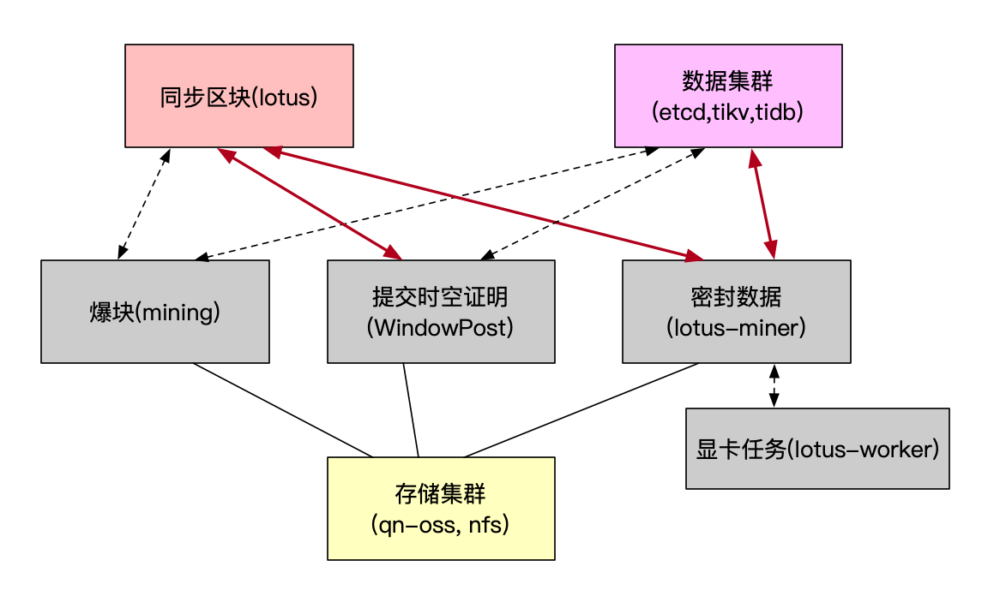

# 运维监控相关工作

各功能模块图：

## 运维监控告警系统

常规运维监控告警项这里不做详述。我只针对挖矿相关的汇总一下:

- 链同步状态
- lotus,lotus-miner,lotus-worker进程状态监控
- lotus,lotus-miner,lotus-worker三者之间连接状态监控(超时，重连)，有问题重启
- 矿工消息池数量,消息拥堵情况
- 矿工手续费价格
- 矿工余额
- 节点连接数
- 各节点版本号
- 告警日志分析（ELK）
- actor矿工的实时状态,算力情况，miner balance, worker balance, Proving status等
- lotus-miner每个deadline时空证明状态(计算时长，失败率，手续费等)
- lotus-miner,lotus-worker复制证明时间，状态，错误率
- lotus-miner挖矿状态：爆块时间点，爆块计算时间，幸运值等
- ~~nfs连接状态~~
- 七牛私有云oss超时，重传次数,上传,下载时间,网络带宽监控
- 集群总workers数量，矿机在线数等。
- lotus,lotus-miner(master,mining)灾备切换
- lotus负载均衡
- sector僵死，状态异常等
- 显卡细节监控（使用率，温度，驱动版本号，显存使用率情况）
- lotus占用磁盘空间，lotus的io情况(iops,iowait)
- lotus网络带宽状态
- lotus连接的peers数量
- wallet安全

## 工作计划安排

- fil新版本的合并功能测试等。
- fil支持32GiB,64GiB大小扇区。
- fil支持多版本(oss,nfs)
- 七牛存储池之前的种种问题的跟进处理。
- 运维监控告警年前功能未实现完全和需要优化的功能。
- 更智能更清晰可视化的跟踪管理矿机web界面(待定)。
- 集群的灾备功能。
- fil收益率提升。
- fil的产出性能持续优化跟进。
- fil的应用层存储生态开发。
- fil的应用层与其他区块链比如NFT web3.0生态的持续跟进。
- polkadot生态扩展研究，substrate组件的研究。为新业务可能会赶超eth的生态做准备。
- 传统币btc,eth生态的跟进。
- eth生态layer2有关zkRollup的研发。
- eth生态web3.0应用跟进。现在eth的应用层非常迅猛，我们为这部分投入不仅可以在eth增加收入，在未来的fil,polkadot生态上也更快速的能切换。
- 联盟链fabric研发。

