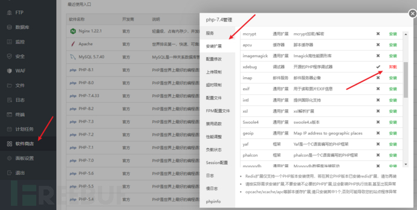
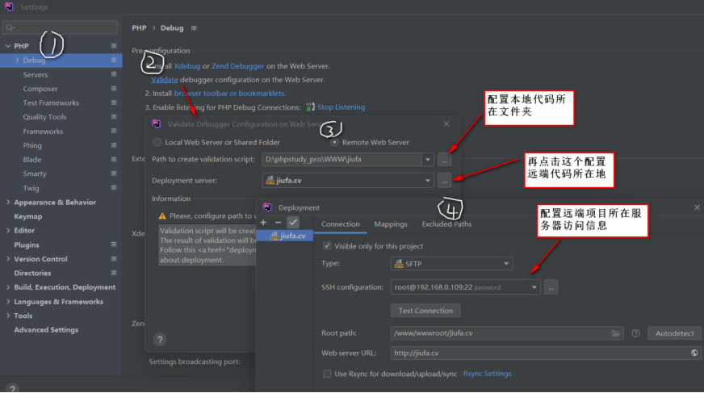
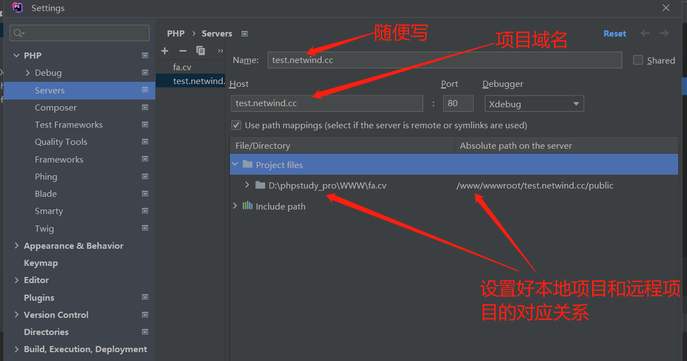
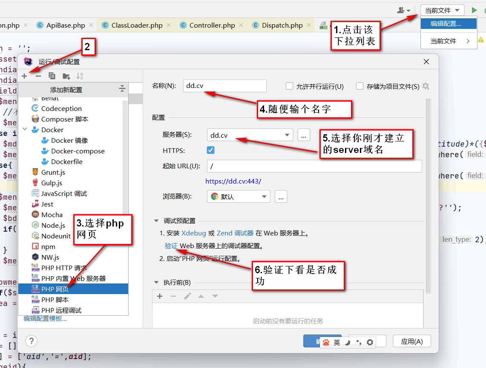
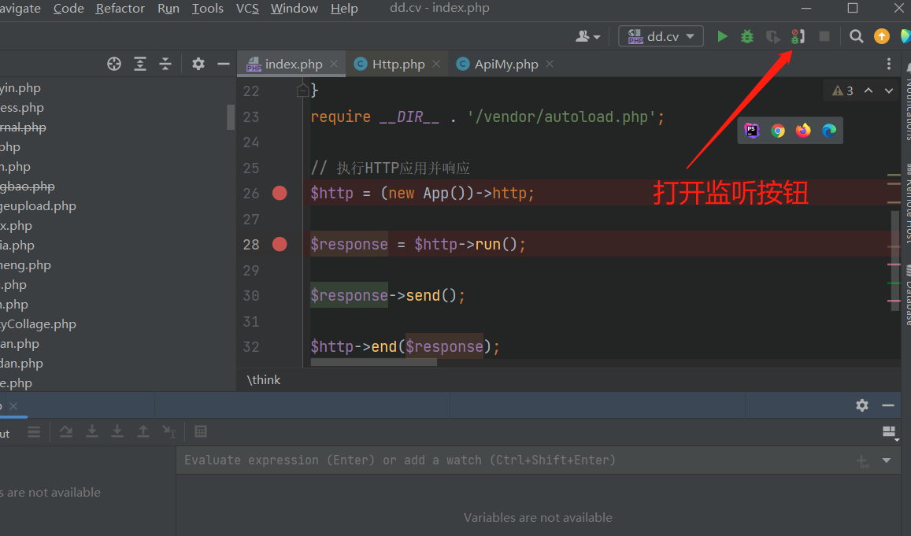

# idea常用 

# 改键

macOs copy

- Find Usages: ctl+\, s
- Back: ctl+t, t
- Search Everywhere: ctl+\, t
- Previous Method: cmd+[
- Go to Declartion or Usages: ctl+]

# other
- Editor->Font: JetBrains Mono  size: 16, Line spacing: 1.2
- Editor->General->Editor Tabs->Tab limit: 40 (更改打开Tab数)
- fond 单独设置一下 console 的字体大小，一般用小一号的字体
- version control->commit->去掉 Use non-modal commit interface 即可显示local changes 窗口


# 插件

- Rainbow Brackets
- IdeaVim
- Markdown
- CodeGlance 代码地图,好用
- Material Theme UI
- Translation
- Toml 为了rust的Cargo.toml
- Active Intellij Tab Hightlighter 高亮当前标签页
- One Dark theme
- Tabnine
- .ignore
- Atom Material Icons
- translation
- RestfulTool2 改键搜索: request service -> `ctl+cmd+/`. java 搜索restful 接口用的.

## 配置

**translation**
 在 tools->Translation 里面引擎选择有道翻译，然后登录：[https://ai.youdao.com/console/#/app-overview](https://ai.youdao.com/console/#/app-overview) 去创建一个 id 和密钥就可以使用。


快捷键是： `ctrl+cmd+u`

# rust

安装代码风格组件 
```bash
rustup component add rustfmt-preview
rustup update 更新所有组件 
cargo fmt
```

## 竖屏

- 先调节显示器设置里面有个纵屏
- 再点系统里面设置，然后点到要竖屏的那个屏，再点集合窗口里面设置旋转90度即可


## IDEA

- 搜索 font 改字体
- search encoding 改为 UTF-8 编码
- autoscroll: Project 里面选择 Always select opened file.
- auto import: 选中: Optimize imports on the fly(会帮我们删除没有用的导入)
- Compiler->Build project automatically 自动编译
- Op+cmd+v: 生成新变量
- shift+cmd+v: 调出历史粘贴板内容
- op+cmd+L: 格式化
- cmd+d: 复制一行并且放到下面
- shift+cmd+o: 查找文件
- shift+shift: 万能查找
- alt+enter: 万能快捷键
  * 见到红色报错的就按这个键
- java 以及热部署
  * 增加devtools 依赖
  * Compiler->Build project automatically 自动编译
  * Advanced Settings -> 选中 Allow auto-make to start even if developed application is currently running
  * 部署好之后，你修改想看效果，可以手动点一下 Build Project 那个小锤子，会立即自动热部署的。
  * 如果idea找不到maven的选项: **右键pom.xml文件, 点击" add as maven project "**
  * 设置JDK: 全局设置在File|New Projects Setup|Structure里面设置JDK. 局部的设置在File|Project Structure里面设置。点击SDKs|右边的加号|Add JDK...|选择你的JDK安装目录增加|然后点击Project选择你要的版本。

## phpstorm 远程xdebug wordpress 宝塔项目

[phpstrom xdebug](https://www.cnblogs.com/eminer/p/17247178.html)

服务器(linux): 192.168.1.253
phpstorm client ip(mac): 192.168.1.220

1, 首先在宝塔里面找到php8.1 然后安装扩展里面找到xdebug, 安装它



2, 修改php的配置文件，增加内容如下然后重启php81：

```ini
[xdebug]
xdebug.mode = debug                    ; 启用调试功能（breakpoint、stack trace） :contentReference[oaicite:4]{index=4}
xdebug.start_with_request = yes        ; 每次请求都触发调试会话 :contentReference[oaicite:5]{index=5}
xdebug.client_host = 192.168.1.220         ; IDE 监听地址 :contentReference[oaicite:6]{index=6}
xdebug.client_port = 9003              ; 默认端口，与 IDE 配置保持一致 :contentReference[oaicite:7]{index=7}
xdebug.idekey = PHPSTORM               ; 与 PhpStorm 中的 IDE Key 对应 :contentReference[oaicite:8]{index=8}
xdebug.discover_client_host = true    ; 
zend_extension = /www/server/php/81/lib/php/extensions/no-debug-non-zts-20210902/xdebug.so
```

3, 配置phpstorm 在文件->设置->语言与框架中->PHP->debug PHP->debug 设置端口，端口默认为9003，小编配置的是9003，需要与上面php.ini中的xdebug.remote_port保持一致。

**一定要去掉: Break at first line in PHP scripts**


4, 在上述窗口中点击validate按钮，如下图所示设置并检验是否成功。看提示的内容即可，不要看到红色就以为错了。



5, 在在文件->设置->语言与框架中->PHP->server中，点击+号按钮，添加server，如下图分别是情景1本地服务器和情景2的远程服务器配置说明。注意如果是https协议网页，端口需填上443 文件->设置->语言与框架中->PHP->server中，点击+号按钮，添加server，如下图分别是情景1本地服务器和情景2的远程服务器配置说明。注意如果是https协议网页，端口需填上443 



6, 如下图所示为该项目建立调试器 php web page:



7, 打开如下图所示的监听按钮，开始监听访问信号，准备调试



好了，经过以上配置就基本上配置成功了，剩下的就是用phpstorm打开本地项目，然后打开需要断点调试的代码文件，在左边行号旁双击插入断点，开始调试。开启调试有两种方法，一个是利用phpstorm的内置php执行环境调试，另一个是用浏览器直接访问文件所在网址来调试，小编不推荐第一种，这种不但配置麻烦，而且与实际生产环境脱节，不如直接使用浏览器来调试，如果你要用浏览器调试，建议用chrome类浏览器，并安装上xdebug helper插件，其实如果不想安装插件，就需要设置cookie了，为本域添加一条“XDEBUG_SESSION=PHPSTORM”，也一样能达到效果，这种方法特别适合用postman之类工具来开启调试，非常方便。如果用xdebug helper插件，需要简单设置下.
