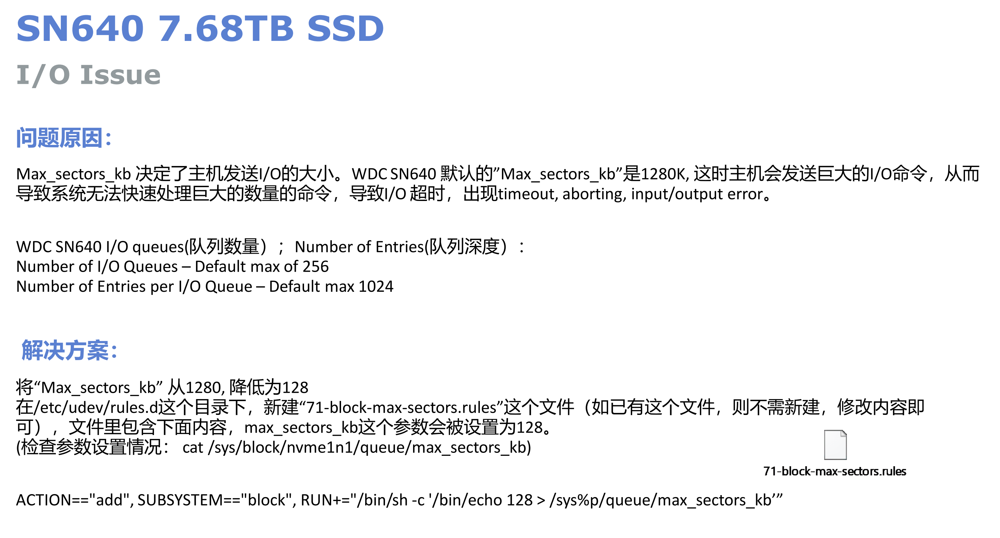

# max_sectors_kb 值修改




解决方案：

**sudo vi /etc/udev/rules.d/71-block-max-sectors.rules** 写入内容：

```text
ACTION=="add", SUBSYSTEM=="block", RUN+="/bin/sh -c '/bin/echo 128 > /sys%p/queue/max_sectors_kb'"
```

然后重启，重启后再查看：

```bash
cat /sys/block/md0/queue/max_sectors_kb
128
cat /sys/block/nvme0n1/queue/max_sectors_kb
128
```

[参考](https://longwhiteclouds.com/2016/03/06/default-io-size-change-in-linux-kernel/)
