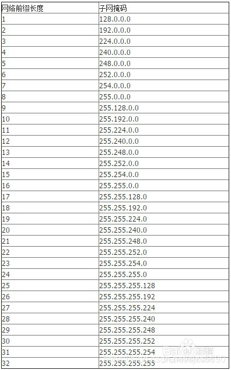

# ubuntu利用netplay配置

详细的配置[https://netplan.io/](https://netplan.io/)

```bash
# 在应用改变之前，让我们测试一下配置。
sudo netplan try
sudo netplan --debug apply
sudo netplan apply

# 重启服务
sudo systemctl restart system-networkd
# 如果是桌面版：
sudo systemctl restart network-manager
```

**使用dhcp**:
```yaml
network:
  version: 2
  renderer: networkd
  ethernets:
    enp3s0:
      dhcp4: true
```

**使用静态ip**:
```yaml
# This is the network config written by 'subiquity'
network:
  version: 2
  ethernets:
    eno1:
      dhcp4: true
    eno2:
      dhcp4: no
      addresses: [192.168.1.141/24]
      optional: true
      gateway4: 192.168.1.1
      nameservers:
              addresses: [183.221.253.100,8.8.8.8]
    eno3:
      dhcp4: true
    eno4:
      dhcp4: true
```

**在单网卡上使用多个 IP 地址(同一网段)**：
```yaml
network:
  version: 2
  renderer: networkd
  ethernets:
    enp3s0:
     addresses:
       - 10.100.1.38/24
       - 10.100.1.39/24
     gateway4: 10.100.1.1
```

**在单网卡使用多个不同网段的IP地址**:
```yaml
network:
  version: 2
  renderer: networkd
  ethernets:
    enp3s0:
     addresses:
       - 9.0.0.9/24
       - 10.0.0.10/24
       - 11.0.0.11/24
     #gateway4:    # unset, since we configure routes below
     routes:
       - to: 0.0.0.0/0
         via: 9.0.0.1
         metric: 100
       - to: 0.0.0.0/0
         via: 10.0.0.1
         metric: 100
       - to: 0.0.0.0/0
         via: 11.0.0.1
         metric: 100
```

其它都好理解，但是addresses后面的24是什么

addresses along with the subnet prefix length (e.g. /24). 

地址以及子网前缀长度

这个代表掩码，24代表255.255.255.0（二进制:11111111.11111111.11111111.0)24个是1

附一个百度查的列表


