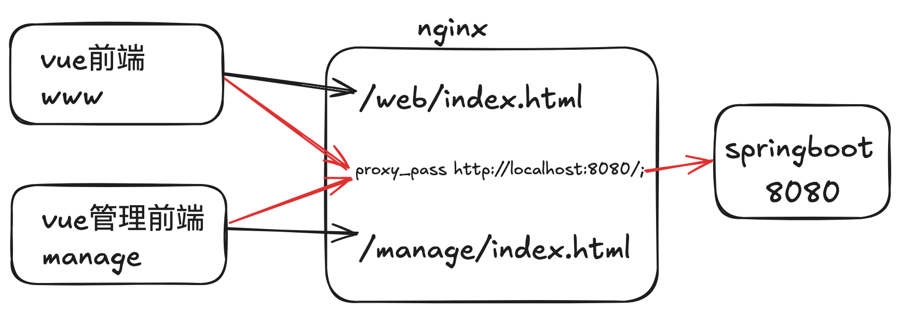

# Australia House deploy



## web.conf

```nginx
server {
    listen              443 ssl http2;
    listen              [::]:443;
    server_name  www.emacsvi.com emacsvi.com;
    charset utf-8;
    ssl_certificate     /root/liw/cert-files/fullchain.cer;
    ssl_certificate_key /root/liw/cert-files/emacsvi.com.key;

    # 前端展示页面的地址
    location / {
        root   /root/liw/web;
        try_files $uri $uri/ /index.html;
        index  index.html index.htm;
    }

    # 后端java server的请求
    location /prod-api/ {
        proxy_set_header Host $http_host;
        proxy_set_header X-Real-IP $remote_addr;
        proxy_set_header REMOTE-HOST $remote_addr;
        proxy_set_header X-Forwarded-For $proxy_add_x_forwarded_for;
        proxy_pass http://localhost:8080/;
    }

    error_page   500 502 503 504  /50x.html;
    location = /50x.html {
        root   html;
    }
}
```

## manage.conf

```nginx
server {
    listen              443 ssl http2;
    listen              [::]:443;
    server_name  manage.emacsvi.com;
    charset utf-8;
    ssl_certificate     /root/liw/cert-files/fullchain.cer;
    ssl_certificate_key /root/liw/cert-files/emacsvi.com.key;

    # 前端展示页面的地址
    location / {
        root   /root/liw/manage;
        try_files $uri $uri/ /index.html;
        index  index.html index.htm;
    }

    # 后端java server的请求
    location /prod-api/ {
        proxy_set_header Host $http_host;
        proxy_set_header X-Real-IP $remote_addr;
        proxy_set_header REMOTE-HOST $remote_addr;
        proxy_set_header X-Forwarded-For $proxy_add_x_forwarded_for;
        proxy_pass http://localhost:8080/;
    }

    error_page   500 502 503 504  /50x.html;
    location = /50x.html {
        root   html;
    }
}
```
