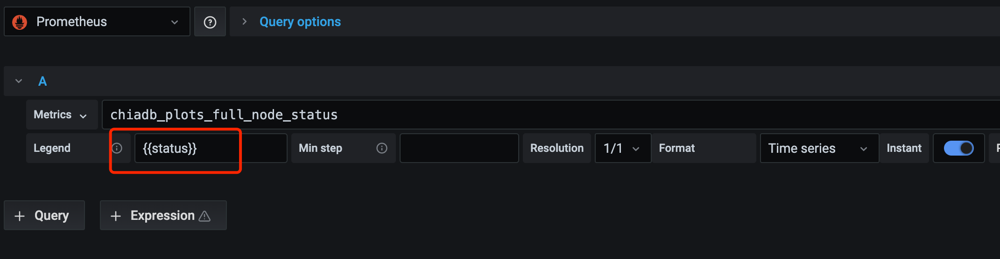

# grafana里面显示字符串内容

比如metrics:
```text
chiadb_plots_full_node_status{instance="chia141:9101", job="chia", status="Full Node Synced"}
```

获取状态的内容：





## go client侧
```golang
	// 声明
	ChiaFullNodeStatusGaugeVec = prometheus.NewGaugeVec(
		prometheus.GaugeOpts{
			Namespace: CHIA_NAMESPCE,
			Subsystem: CHIA_SUBSYSTEM,
			Name:      "full_node_status",
			Help:      "full node status",
		},
		[]string{"status"},
	)

    // 注册
    func init() {
	prometheus.MustRegister(
		ChiaTotalBalanceGaugeVec,
		ChiaPendingBalanceGaugeVec,
		ChiaSpendableBalanceGaugeVec,

		ChiaLastHeightFarmedGaugeVec,
		ChiaTotalFarmedGaugeVec,
		ChiaFarmingStatusGaugeVec,
		ChiaEstimatedNetworkSpaceGaugeVec,

		ChiaFullNodeStatusGaugeVec,
		ChiaFullNodeHeightGaugeVec,
	)

    reg := regexp.MustCompile(`Current Blockchain Status:\s(.*)`)
	result := reg.FindAllStringSubmatch(r, -1)
	if len(result) != 0 && len(result[0]) >= 1 {
		status = result[0][1]
		log.Infof("status=%s", status)
		prometheus.ChiaFullNodeStatusGaugeVec.Reset() // 一定要清除一次，不然会出现很多label不一样的多条记录
		prometheus.ChiaFullNodeStatusGaugeVec.WithLabelValues(strings.TrimSpace(status)).Set(1)
	}

}
```
