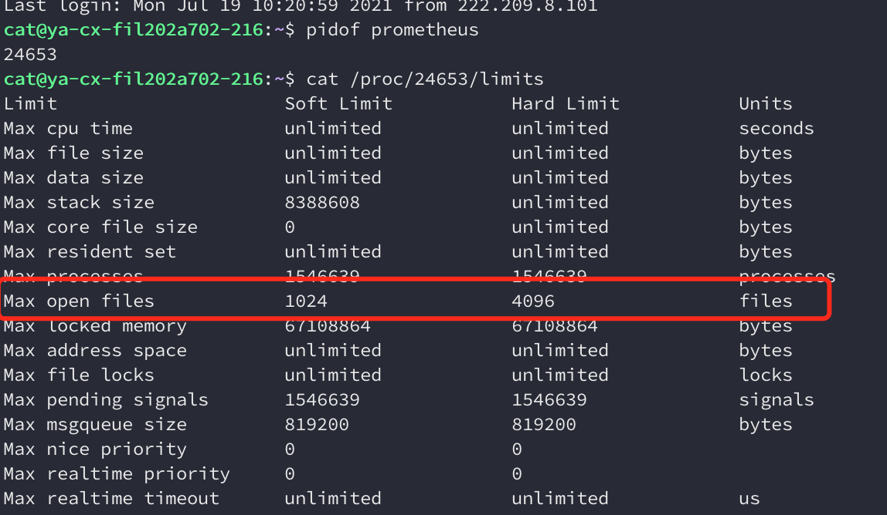

# prometheus too many open file


一直报错，但是系统的ulimits改到100万以上了. 然后看是不是进程的limits被限制了。

```bash
pidof prometheus
cat /proc/24653/limits
```



为何它是正常的？后来一想,它们俩的启动方式不一样.pushgateway是root权限直接启动的.而prometheus是交给了systemd管理.那么问题会不会出在systemd? 说实话我对systemd不熟.所以继续谷歌.然后找到了这个http://smilejay.com/2016/06/centos-7-systemd-conf-limits 帖子.照着帖子上的说明.做了下尝试:

```ini
[Unit]
Description=prometheus
After=network.target

[Service]
ExecStart=/fil/liw/jk/prometheus/prometheus --config.file=/fil/liw/jk/prometheus.yml --storage.tsdb.path=/fil/liw/jk/data --storage.tsdb.retention.time=60d
Restart=always
RestartSec=10
LimitCORE=infinity
LimitNOFILE=65535

[Install]
WantedBy=multi-user.target
```

```bash
sudo cp prometheus.service /lib/systemd/system/
sudo systemctl daemon-reload
sudo systemctl restart prometheus.service
systemctl status prometheus
# 查看日志
journalctl -f -u prometheus
```

## from

- [https://vitzhou.top/20180709_prometheus_many_file/](https://vitzhou.top/20180709_prometheus_many_file/)
