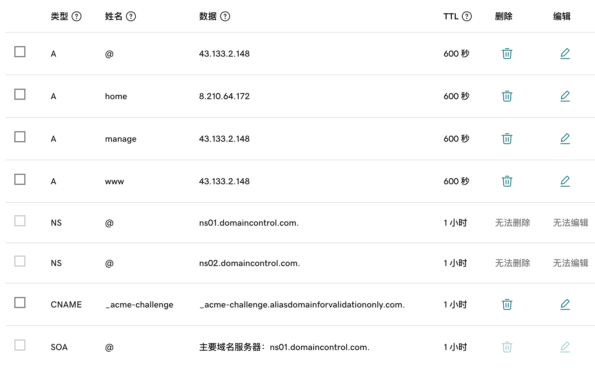

# godaddy 配置ssl

在线上的业务用免费的ssl证书，使用godaddy解析dns, 之前用的dnspod.cn 现在服务器在澳洲或者美国，需要用godaddy可能方便一点。

另外使用acme.sh生成的认证文件也在用在我本地的gitea，因为是全域名生效的。这样就都可以用了。


## acme.sh
简单介绍如何使用acme.sh使用http模式或dns模式签发并安装证书，实现服务器的https访问

### 什么是acme.sh
- acme.sh是一个开源项目，github地址为链接。
- acme.sh 实现了 acme 协议, 可以从 **letsencrypt** 生成免费的SSL证书。
- acme.sh生成的证书拥有自动更新的功能，配置完成后可一直自动运行，保持证书有效性

我这里选择使用dns alias mode的方便自动安装证书：

[acme.sh dns-alias-mode](https://github.com/acmesh-official/acme.sh/wiki/DNS-alias-mode)


### 安装acme.sh
```bash
# 安装acme.sh
curl https://get.acme.sh | sh -s email=liweilijie@gmail.com
# 并创建 一个 shell 的 alias, 例如 .bashrc，方便你的使用: 
vi ~/.bashrc
alias acme.sh=~/.acme.sh/acme.sh
```

### 生成dns权限

在[https://developer.godaddy.com/keys](https://developer.godaddy.com/keys)网站上生成操作API Key, Environment随便，我用的Production.

将生成的Key和Secret导入到环境变量。 生成证书。

```bash
vi ~/.bashrc

export GD_Key="key123456"
export GD_Secret="secret123456"

source ~/.bashrc
```

### set domain CNAME

```text
_acme-challenge.emacsvi.com => _acme-challenge.aliasDomainForValidationOnly.com
```



### 修改dns解析商服务器

acme.sh脚本默认ca服务器是zerossl，经常出错，会导致获取证书的时候一直出现：`Pending, The CA is processing your order, please just wait`.

只需要把ca服务器改成letsencrypt 即可，虽然更改以后还是有概率出现pending，但基本2-3次即可成功

```bash
acme.sh --set-default-ca --server letsencrypt
```

### Issue a cert

acme.sh 真正强大的dns模式的优势是可以使用域名解析商提供的api自动添加记录完成认证。

acme.sh 目前支持 cloudflare, dnspod, cloudxns, godaddy 以及 ovh 等数十种解析商的自动集成。

下面使用godaddy的接口进行申请证书：

```bash
acme.sh --issue --dns dns_gd -d emacsvi.com -d '*.emacsvi.com'
```

**output**:

```text
[Wed Sep 18 14:00:02 CST 2024] Pending. The CA is processing your order, please wait. (1/30)
[Wed Sep 18 14:00:06 CST 2024] Success
[Wed Sep 18 14:00:06 CST 2024] Restoring from /root/.acme.sh/emacsvi.com_ecc/backup/emacsvi.com.nginx.conf to /etc/nginx/conf.d/web.conf
[Wed Sep 18 14:00:06 CST 2024] Reloading nginx
[Wed Sep 18 14:00:06 CST 2024] Verification finished, beginning signing.
[Wed Sep 18 14:00:06 CST 2024] Let's finalize the order.
[Wed Sep 18 14:00:06 CST 2024] Le_OrderFinalize='https://acme-v02.api.letsencrypt.org/acme/finalize/1952874806/306123656176'
[Wed Sep 18 14:00:07 CST 2024] Downloading cert.
[Wed Sep 18 14:00:07 CST 2024] Le_LinkCert='https://acme-v02.api.letsencrypt.org/acme/cert/046fce72cad6c12943eeca537b92ca7cbfb0'
[Wed Sep 18 14:00:08 CST 2024] Cert success.
-----BEGIN CERTIFICATE-----
MIIDeDCCAv6gAwIBAgISBG/OcsrWwSlD7spTe5LKfL+wMAoGCCqGSM49BAMDMDIx
CzAJBgNVBAYTAlVTMRYwFAYDVQQKEw1MZXQncyBFbmNyeXB0MQswCQYDVQQDEwJF
NTAeFw0yNDA5MTgwNTAxMzdaFw0yNDEyMTcwNTAxMzZaMBYxFDASBgNVBAMTC2Vt
YWNzdmkuY29tMFkwEwYHKoZIzj0CAQYIKoZIzj0DAQcDQgAEjeycym0DYgDaYJ3E
1rC78Mti0QYqt/o3CU24+br29Y7m+X8YoUwHgm09JFRnzrTl4769zo8KGCN2AGjl
d6Ka86OCAg4wggIKMA4GA1UdDwEB/wQEAwIHgDAdBgNVHSUEFjAUBggrBgEFBQcD
AQYIKwYBBQUHAwIwDAYDVR0TAQH/BAIwADAdBgNVHQ4EFgQUAib9Z9tI9oTzw6l8
9Rh38kRpxuAwHwYDVR0jBBgwFoAUnytfzzwhT50Et+0rLMTGcIvS1w0wVQYIKwYB
BQUHAQEESTBHMCEGCCsGAQUFBzABhhVodHRwOi8vZTUuby5sZW5jci5vcmcwIgYI
KwYBBQUHMAKGFmh0dHA6Ly9lNS5pLmxlbmNyLm9yZy8wFgYDVR0RBA8wDYILZW1h
Y3N2aS5jb20wEwYDVR0gBAwwCjAIBgZngQwBAgEwggEFBgorBgEEAdZ5AgQCBIH2
BIHzAPEAdwBIsONr2qZHNA/lagL6nTDrHFIBy1bdLIHZu7+rOdiEcwAAAZIDt3Mo
AAAEAwBIMEYCIQD91u6MOz9wPt3yWE5vj0K5oG+AQeus8UhJVd5ProBK4AIhAPBv
uyQs2EOMvq1y9IzsLGfB8tVidBMM811G3z/sLo9BAHYAGZgQcQnw1lIuMIDSnj9k
u4NuKMz5D1KO7t/OSj8WtMoAAAGSA7dzYwAABAMARzBFAiEAq4ZdcWR5DVYiH51O
DKtGNkYpWgYgKjm87U+81X+McfQCIAEB8iJv6Xdk5CAVn+tqYEHcII2Cz7L1bFL5
f01ySKJrMAoGCCqGSM49BAMDA2gAMGUCMQDatYyJX4KCejrzdbB81VSDjzeJ8Js4
V++XbOFfQhmaxKqYCdhiMWOEg+OUZmMk4hoCMFE2WSiP1zp3kheK9PiMi+lfOBiL
2TRHTGltrmI9X3P+I3b6AP9bb5gVjBW3TVpQrw==
-----END CERTIFICATE-----
[Wed Sep 18 14:00:08 CST 2024] Your cert is in: /root/.acme.sh/emacsvi.com_ecc/emacsvi.com.cer
[Wed Sep 18 14:00:08 CST 2024] Your cert key is in: /root/.acme.sh/emacsvi.com_ecc/emacsvi.com.key
[Wed Sep 18 14:00:08 CST 2024] The intermediate CA cert is in: /root/.acme.sh/emacsvi.com_ecc/ca.cer
[Wed Sep 18 14:00:08 CST 2024] And the full-chain cert is in: /root/.acme.sh/emacsvi.com_ecc/fullchain.cer
```

## copy/安装 证书

前面证书生成以后, 接下来需要把证书 copy 到真正需要用它的地方.

注意, 默认生成的证书都放在安装目录下: ~/.acme.sh/, 请不要直接使用此目录下的文件, 例如: 不要直接让 nginx/apache 的配置文件使用这下面的文件. 这里面的文件都是内部使用, 而且目录结构可能会变化.

正确的使用方法是使用 --install-cert 命令,并指定目标位置, 然后证书文件会被copy到相应的位置, 例如:

```bash
acme.sh --install-cert -d emacsvi.com \
--key-file       /root/liw/cert-files/emacsvi.com.key  \
--fullchain-file /root/liw/cert-files/fullchain.cer \
--reloadcmd     "service nginx force-reload"
```

注意：不能使用cp命令直接将证书文件复制过去，而是需要用acme.sh的安装命令。这样才能借助acme.sh在证书过期后自动续签

output:

```text
root@VM-4-41-ubuntu:~# acme.sh --install-cert -d emacsvi.com \
--key-file       /root/.acme.sh/emacsvi.com_ecc/emacsvi.com.key  \
--fullchain-file /root/.acme.sh/emacsvi.com_ecc/fullchain.cer \
--reloadcmd     "service nginx force-reload"
[Wed Sep 18 14:04:57 CST 2024] The domain 'emacsvi.com' seems to already have an ECC cert, let's use it.
[Wed Sep 18 14:04:58 CST 2024] Installing key to: /root/.acme.sh/emacsvi.com_ecc/emacsvi.com.key
[Wed Sep 18 14:04:58 CST 2024] Installing full chain to: /root/.acme.sh/emacsvi.com_ecc/fullchain.cer
[Wed Sep 18 14:04:58 CST 2024] Running reload cmd: service nginx force-reload
[Wed Sep 18 14:04:58 CST 2024] Reload successful
root@VM-4-41-ubuntu:~#
```

(一个小提醒, 这里用的是 service nginx force-reload, 不是 service nginx reload, 据测试, reload 并不会重新加载证书, 所以用的 force-reload)

Nginx 的配置 ssl_certificate 使用 /etc/nginx/ssl/fullchain.cer ，而非 /etc/nginx/ssl/<domain>.cer ，否则 SSL Labs 的测试会报 Chain issues Incomplete 错误。

--install-cert命令可以携带很多参数, 来指定目标文件. 并且可以指定 reloadcmd, 当证书更新以后, reloadcmd会被自动调用,让服务器生效.

### godaddy api key 备忘：

```text
key:
dKNn3o6LeAFr_EypB2sFJLJWjondgYPTgeX
secret:
RxqJZntucrsr26KxNVgo2X
```

## 配置nginx

在nginx的配置文件中增加ssl的路径即可：

```nginx
ssl_certificate     /root/liw/cert-files/fullchain.cer;
ssl_certificate_key /root/liw/cert-files/emacsvi.com.key;
```

web.conf:
```nginx
server {
    listen              443 ssl http2;
    listen              [::]:443;
    server_name  www.emacsvi.com emacsvi.com;
    charset utf-8;
    ssl_certificate     /root/liw/cert-files/fullchain.cer;
    ssl_certificate_key /root/liw/cert-files/emacsvi.com.key;

    # 前端展示页面的地址
    location / {
        root   /root/liw/web;
        try_files $uri $uri/ /index.html;
        index  index.html index.htm;
    }

    # 后端java server的请求
    location /prod-api/ {
        proxy_set_header Host $http_host;
        proxy_set_header X-Real-IP $remote_addr;
        proxy_set_header REMOTE-HOST $remote_addr;
        proxy_set_header X-Forwarded-For $proxy_add_x_forwarded_for;
        proxy_pass http://localhost:8080/;
    }

    error_page   500 502 503 504  /50x.html;
    location = /50x.html {
        root   html;
    }
}
```

manage.conf

```nginx
server {
    listen              443 ssl http2;
    listen              [::]:443;
    server_name  manage.emacsvi.com;
    charset utf-8;
    ssl_certificate     /root/liw/cert-files/fullchain.cer;
    ssl_certificate_key /root/liw/cert-files/emacsvi.com.key;

    # 前端展示页面的地址
    location / {
        root   /root/liw/manage;
        try_files $uri $uri/ /index.html;
        index  index.html index.htm;
    }

    # 后端java server的请求
    location /prod-api/ {
        proxy_set_header Host $http_host;
        proxy_set_header X-Real-IP $remote_addr;
        proxy_set_header REMOTE-HOST $remote_addr;
        proxy_set_header X-Forwarded-For $proxy_add_x_forwarded_for;
        proxy_pass http://localhost:8080/;
    }

    error_page   500 502 503 504  /50x.html;
    location = /50x.html {
        root   html;
    }
}
```

## References:

- [acme.sh说明 official](https://github.com/acmesh-official/acme.sh/wiki/%E8%AF%B4%E6%98%8E)
- [dns alias](https://github.com/acmesh-official/acme.sh/wiki/DNS-alias-mode)
- [acme.sh备忘](https://oneearmouse.com/posts/acme.sh-usage/)
- [acme.sh godday](https://wikoding.com/article/65fa8248e33e32348fef7dbb)
